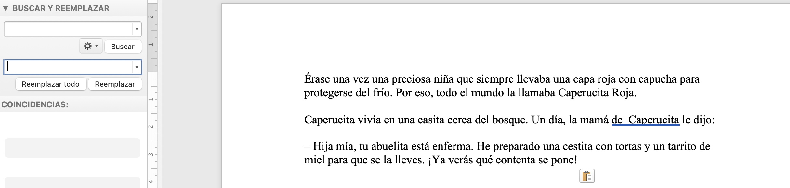
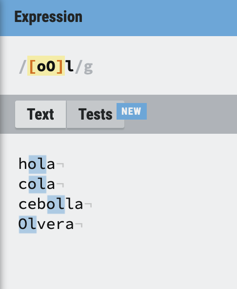

```{r setup, include=FALSE}
knitr::opts_chunk$set(echo = FALSE)
```

## Reemplazar


## Búsquedas más complejas



## Expresiones regulares

- **expresión regular** (*regular expression*, *regex*): secuencia de caracteres que conforma un patrón de búsqueda.
- **comodines** (*wildcards*): carácter especial que puede ponerse en lugar de cualquier otro carácter. ej `*.?+`

## Regular expressions

- funcionan sobre texto plano.
- transversal a lenguages de programación.(*UNIX*, *R*, *Python* ...)

## Texto plano

- texto sin formato: ej. **txt** **csv** **tsv** ~~docx~~
- codificación simple => legible por muchos programas
- editor de texto plano: eg [Notepad++](https://notepad-plus-plus.org/downloads/)
- constructor online de [ReGex](https://regexr.com/)

## Ejercicios

- <https://github.com/csmiguel/learn-regex>
- online regex tester: <https://regexr.com/>

